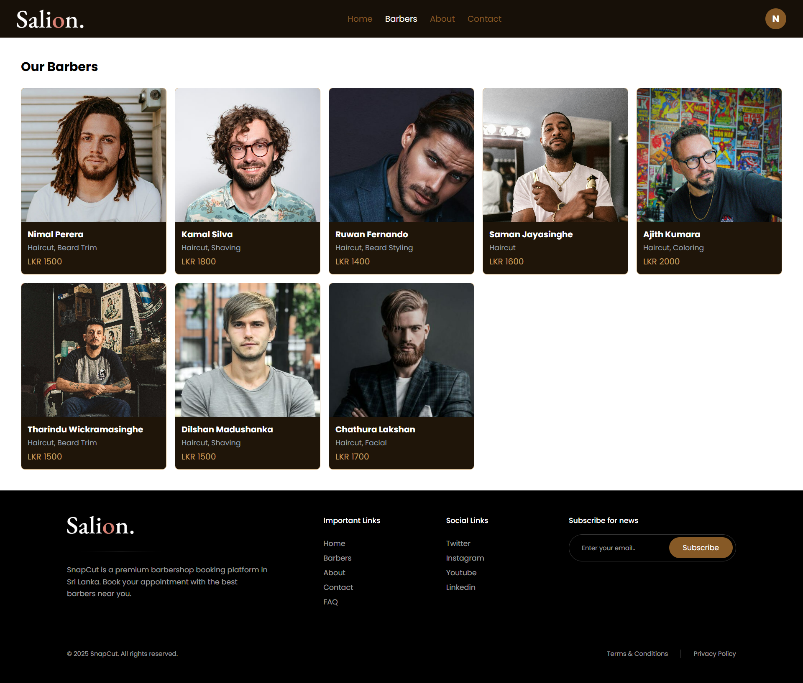
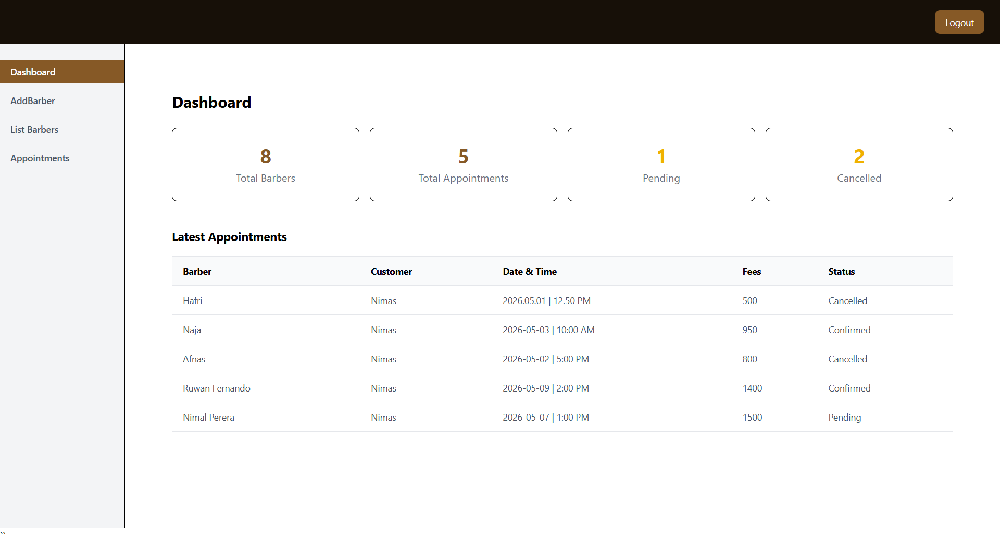
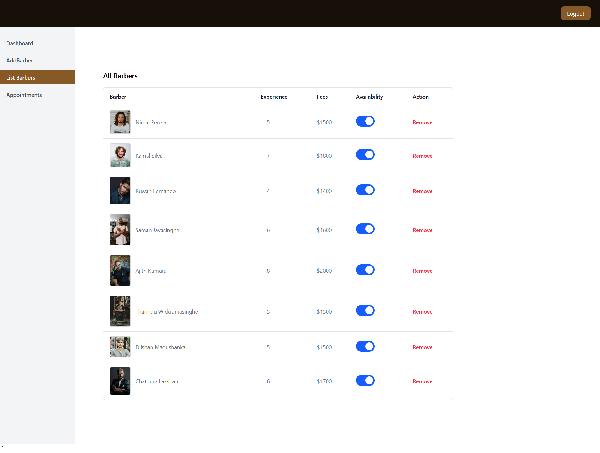

# SnapCut ✂️

A full-stack barbershop appointment booking platform built for Sri Lanka. Customers can browse barbers, book appointments, and manage their bookings. Admins can manage barbers and appointments through a dedicated dashboard.

---

## Screenshots

### Home Page


### Barbers Page



### Appointment Booking


### Admin Dashboard



### Admin Barbers List



## Live Demo

- **Frontend:** [snapcut-frontend.vercel.app](https://snap-cut-frontend.vercel.app)
- **Admin Panel:** [snapcut-admin.vercel.app](https://snap-cut-admin.vercel.app)
- **Backend API:** [snapcut-backend.vercel.app](https://snap-cut-backend.vercel.app)

---

## Features

### Customer

- Register and login with JWT authentication
- Browse all available barbers
- View barber profile with services and fees
- Book appointments with date and time slot selection
- View and cancel personal appointments

### Admin

- Secure admin login
- Add new barbers with image upload (Cloudinary)
- View and remove barbers
- Toggle barber availability
- View all appointments
- Confirm or cancel appointments
- Dashboard with stats (total barbers, appointments, pending, cancelled)

---

## Tech Stack

### Frontend

- React.js
- Tailwind CSS
- Axios
- React Router DOM
- React Toastify
- Vite

### Backend

- Node.js
- Express.js
- MongoDB (Mongoose)
- JWT Authentication
- Bcrypt
- Cloudinary (image upload)
- Multer
- Dotenv
- CORS

---

## Project Structure

```
SnapCut/
├── backend/
│   ├── config/
│   │   ├── db.js
│   │   └── cloudinary.js
│   ├── controller/
│   │   ├── userController.js
│   │   ├── barberController.js
│   │   └── appointmentController.js
│   ├── middleware/
│   │   ├── authUser.js
│   │   └── authAdmin.js
│   ├── models/
│   │   ├── userModel.js
│   │   ├── barberModel.js
│   │   └── appointmentModel.js
│   ├── routes/
│   │   ├── userRoute.js
│   │   ├── barberRoute.js
│   │   └── appointmentRoute.js
│   └── server.js
├── frontend/
│   └── src/
│       ├── components/
│       ├── context/
│       ├── pages/
│       └── assets/
└── admin/
    └── src/
        ├── components/
        ├── pages/
        └── assets/
```

---

## API Endpoints

### User

| Method | Endpoint              | Description       |
| ------ | --------------------- | ----------------- |
| POST   | /api/user/register    | Register new user |
| POST   | /api/user/login       | User login        |
| POST   | /api/user/admin-login | Admin login       |
| GET    | /api/user/profile     | Get user profile  |

### Barber

| Method | Endpoint                 | Description                 |
| ------ | ------------------------ | --------------------------- |
| POST   | /api/barber/add          | Add new barber (admin)      |
| GET    | /api/barber/list         | Get all barbers             |
| POST   | /api/barber/remove       | Remove barber (admin)       |
| POST   | /api/barber/availability | Toggle availability (admin) |

### Appointment

| Method | Endpoint                  | Description                  |
| ------ | ------------------------- | ---------------------------- |
| POST   | /api/appointment/book     | Book appointment             |
| GET    | /api/appointment/list     | Get user appointments        |
| POST   | /api/appointment/cancel   | Cancel appointment           |
| GET    | /api/appointment/list-all | Get all appointments (admin) |
| POST   | /api/appointment/status   | Update status (admin)        |

---

## Getting Started

### Prerequisites

- Node.js v18+
- MongoDB Atlas account
- Cloudinary account

### Backend Setup

```bash
cd backend
npm install
```

Create `.env` file:

```
MONGODB_URI=your_mongodb_uri
JWT_SECRET=your_jwt_secret
CLOUDINARY_NAME=your_cloud_name
CLOUDINARY_API_KEY=your_api_key
CLOUDINARY_SECRET_KEY=your_secret_key
```

```bash
npm run dev
```

### Frontend Setup

```bash
cd frontend
npm install
```

Create `.env` file:

```
VITE_BACKEND_URL=http://localhost:4000
```

```bash
npm run dev
```

### Admin Setup

```bash
cd admin
npm install
```

Create `.env` file:

```
VITE_BACKEND_URL=http://localhost:4000
```

```bash
npm run dev
```

---

## Deployment

- **Backend** → [Vercel.com](https://vercel.com)
- **Frontend** → [Vercel.com](https://vercel.com)
- **Admin** → [Vercel.com](https://vercel.com)

---

## Author

Built by **Nimas** — a Sri Lankan MERN stack developer.

---

## License

This project is open source and available under the [MIT License](LICENSE).
